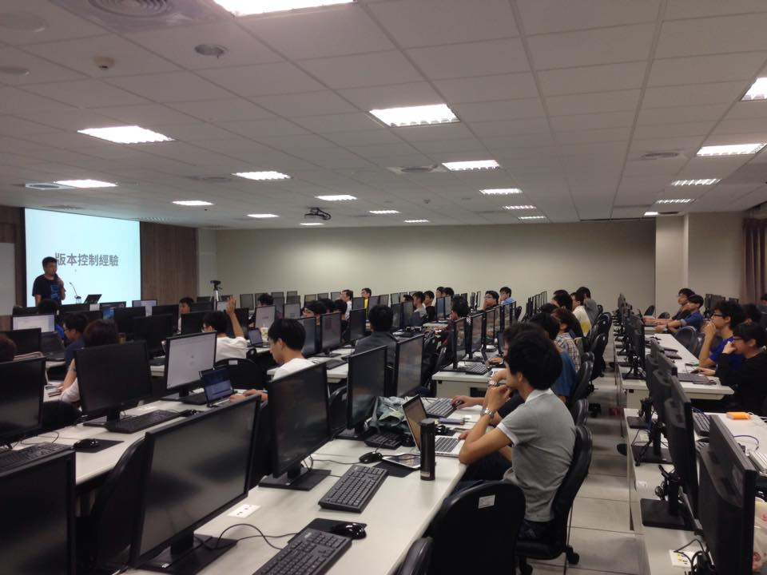

title: 感謝師父 讚嘆師父 Git 超棒 der
output: index.html

--

<h1 style="font-size: 72px">
  感謝師父 讚嘆師父 
  Git 超棒 der
</h1>
 

## Denny Huang

--

### Denny Huang
# 綠衣教主?!

--

  

--

  
  <a href="http://sitcon.org/">http://sitcon.org</a>

--

  

--

  

--

  

--

  

--

  

--

  

--

  

--

  

--

# SITCON 2015
## 2015 / 03 / 7 ＠  中央研究院人文社會館

--

<h1 style="font-size:72px">11 月 Call For Paper</h1>
<h2>
密切注意 SITCON <a href="https://www.facebook.com/groups/sitcon.tw/" target="_blank">FB社團</a> / <a href="https://www.facebook.com/SitconTW" target="_blank">粉絲團</a>
</h2>

--

# 歡迎與我們聯繫
<h2>
  <a href="mailto:contact@sitcon.org">contact@sitcon.org</a>
</h2>

--

  

--

### 總有意外

* 密碼忘記

* 無法接觸實體機器

* Code 沒留

--

# 噢！ 

--

# .git 可以 access

--

### Git
# 版本控制系統

--

### File system

  

--

### Git

   
  

--

### git cat-file -p 3ab828d
 

  

--

### git cat-file -p cffa8a

   
  

--

   
   
   
   
  <a href="https://github.com/denny0223/scrabble">https://github.com/denny0223/scrabble</a>

--

   
   
   
  <code>scrabble http://example.com/</code>

--

# 用 Git 很好

--

<h1 style="font-size: 72px">
  但請務必注意 
  存取權限
</h1>
 

--

# Q & A

--

<h1 style="font-size:72px">Thanks for listening</h1>
